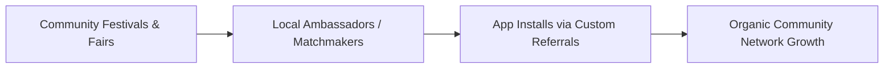

# Go-To-Market (GTM) Strategy

## 📌 Term Explanation: What is a GTM?
A **Go-To-Market (GTM) Strategy** is a comprehensive plan detailing how a product will be launched, distributed, positioned, and sold to customers. It defines the target audience, marketing channels, sales strategy, pricing models, and key messaging required to gain a competitive advantage and minimize market entry risk.

---

# Case Study: BanjaraMatch App-Only Launch Strategy

| Version | 1.1.0 |
| :--- | :--- |
| **Launch Window** | Q3 - Q4 2026 |
| **Target Regions** | Maharashtra, Karnataka, Telangana, Andhra Pradesh |
| **Primary Channel** | Google Play Store (App-Only Strategy) |

---

## 1. Positioning & Value Proposition
Mainstream matrimonial sites treat the Banjara community as a minor sub-caste, leading to poor matches and low relevance. BanjaraMatch is positioned as:
> *"The only safe, audio-first matchmaking space built exclusively for the Banjara community, where trust, gothras, and talukas are verified by our own people."*

---

## 2. Launch Strategy (The "Tanda-to-Tanda" Network)
Unlike typical SaaS products that rely on digital search ads, BanjaraMatch leverages the tight-knit social structure of the Banjara community:

### 2.1. Channel 1: Offline Community Hubs (Ambassadors)
* **Strategy**: Appoint local community leaders or respected elders in major Tandas (Banjara settlements) as "BanjaraMatch Advisors."
* **Execution**: Provide them with an "Advisor Dashboard" in the app where they can refer families, verify local profiles, and earn small commission incentives (₹50 per verified registration).

### 2.2. Channel 2: Gamified In-App Referrals
* **Strategy**: Leverage the existing user base to drive word-of-mouth.
* **Execution**: Integrate deep links using the `banjarabio://` custom scheme. When a user shares a profile with a parent or relative, both users receive **3 free premium profile views** once the referred user downloads the app and completes verification.

### 2.3. Channel 3: Hyper-Local Digital Campaign
* **Strategy**: Geo-targeted social media advertising.
* **Execution**: Create audio/video ads in the Lambadi dialect on YouTube, Instagram, and ShareChat, targeted specifically at users in rural areas of Maharashtra (Nanded, Yavatmal, Jalgaon) and Telangana.

---

## 3. Product Configuration & Distribution
To maintain absolute security and prevent scrapers, BanjaraMatch employs an **App-Only model**:
* **No Web Discovery Feed**: Users cannot browse profiles via standard web URLs. All deep links redirect to the native Android/iOS app.
* **Low-Storage footprint**: Optimized package size (<18MB download) for lower-end smartphones common in rural regions.

---

## 4. Phase-Wise Rollout Plan

### Phase 1: Alpha Testing (Month 1)
* Target: 1,000 users in Nanded (Maharashtra) and Adilabad (Telangana).
* Goal: Eliminate ANR issues, validate Supabase Realtime messaging under weak 3G/4G networks.

### Phase 2: Regional Beta (Months 2-3)
* Target: 20,000 users.
* Launch the 7-day Login Rewards system to boost daily active usage (DAU).

### Phase 3: State-Wide Launch (Months 4-6)
* Launch PR campaigns during major festivals (e.g., Teej and Holi).
* Deploy offline registration kiosks at community gatherings.
