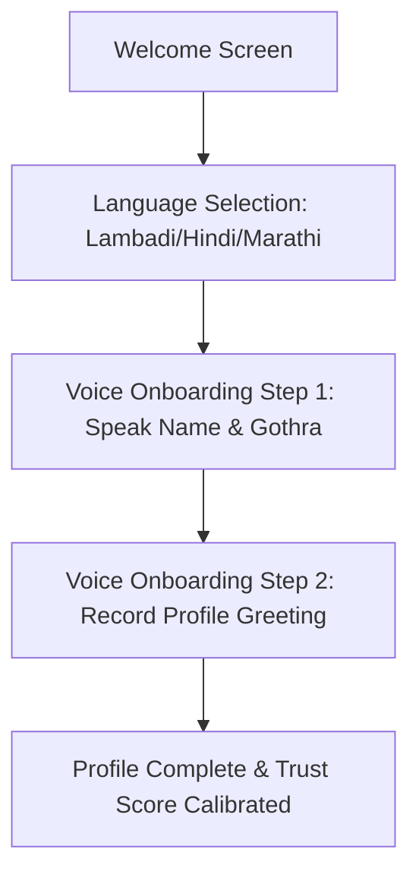

# Product Requirements Document (PRD)

## 📌 Term Explanation: What is a PRD?
A **Product Requirements Document (PRD)** is a blueprint that defines the features, functionality, and user experience of a specific product or feature before development begins. It answers *what* needs to be built, *who* it is for, and *why* it matters, guiding the engineering, design, and QA teams through execution.

---

# Case Study: Audio-First Voice Onboarding & Verification for BanjaraMatch

| Document Status | Draft |
| :--- | :--- |
| **Target Release** | Q4 2026 |
| **Owner / PM** | Product Team, BanjaraMatch |
| **Engineering Lead** | Tech Lead, BanjaraMatch |
| **Design Lead** | UX Lead, BanjaraMatch |

---

## 1. Executive Summary & Objective
A significant portion of the Banjara community resides in tier-3/4 towns and rural settlements (Tandas) with varying literacy levels and low-bandwidth connections. Text-heavy forms create high friction during registration. 

The **Audio-First Voice Onboarding & Verification** feature aims to replace manual text typing during signup with a simple, voice-guided flow. Users can speak their profile details (name, taluka, family gothra) in their native **Lambadi (Banjara)** or local language, and record an audio greeting. This audio greeting serves both as an accessibility aid for discovery and as a trust validation signal (Trust Score increment).

---

## 2. User Personas
1. **Ramesh Nayak (26, Rural Farmer / Entrepreneur)**
   * *Profile*: Speaks Lambadi and Marathi. Lives in a Tanda near Nanded, Maharashtra.
   * *Pain Point*: Struggles with typing complex spelling of gothras and details on small screens. Prefers listening and speaking over reading.
2. **Kavita Rathod (24, College Graduate)**
   * *Profile*: Tech-savvy, lives in a town, seeks verification and trust.
   * *Pain Point*: Wants to ensure matches are genuine. Needs voice verification to filter out fake profiles.

---

## 3. High-Level Requirements & Feature Scope

### 3.1. Voice-Guided Registration (Onboarding)
* **Interactive Audio Prompts**: The app plays spoken audio instructions (e.g., *"Please say your name and gothra after the beep"*).
* **Dual Input**: Users can tap to speak, which transcribes details via on-device Speech-to-Text (STT) while keeping the original voice clip as a backup.
* **Audio Welcome Greeting**: Mandatory 10-second voice intro that other users can play directly from their cards on the discovery feed.

### 3.2. Audio Profile verification (Trust Score Integration)
* **Voice ID Check**: Verification badge matches the voice sample with a spoken confirmation phrase.
* **Security & Concurrency Guard**: Secure file storage via Supabase Storage buckets (`profile-voice-notes`) with proper RLS policies.

---

## 4. User Flow & UI Specifications

### Screen 1: Voice Verification Recorder
* **UI Elements**:
  * Large, pulsating central record button (visual feedback).
  * Waveform visualization during recording (60 FPS micro-animation using Flutter CustomPainter).
  * Prominent text: "Hold to Speak" / "दाबून बोला" / "दाब मने बोलो".
* **Audio Compression**: Record in `.aac` / `.m4a` format to minimize cellular bandwidth in rural locations. Max file size: **250KB**.

---

## 5. Technical Architecture & Constraints
* **State Management**: Reactive State using Riverpod (`voiceOnboardingProvider`).
* **Storage & Network**: 
  * Save local recordings in the app's persistent `Documents` directory (avoiding ephemeral `tmp` cache clearances).
  * Upload to Supabase Storage Bucket `voice_verifications/` with a retry manager to handle high-latency or fluctuating networks.
* **ANR Prevention**: Audio compression and transcoding are run in a background Dart Isolate to prevent blocking the UI thread (monitored by `GlobalWatchdog`).

---

## 6. Non-Functional Requirements (NFRs)
* **Performance**: UI rendering must maintain a consistent 60 FPS during waveform animations.
* **Offline Resilience**: Allow local recording offline, queuing the upload to Supabase until network coverage resumes.
* **Accessibility**: Fully compatible with TalkBack/VoiceOver; screen reader labels on all custom audio controls.

---

## 7. Key Metrics for Success
* **Registration Completion Rate**: Increase by **15%** in tier-3/4 target regions within 60 days of release.
* **Profile Verification Rate**: Reach **40%** of monthly active users verified by voice.
* **ANR & Crash Rate**: Maintained at `< 0.05%` during voice operations.
