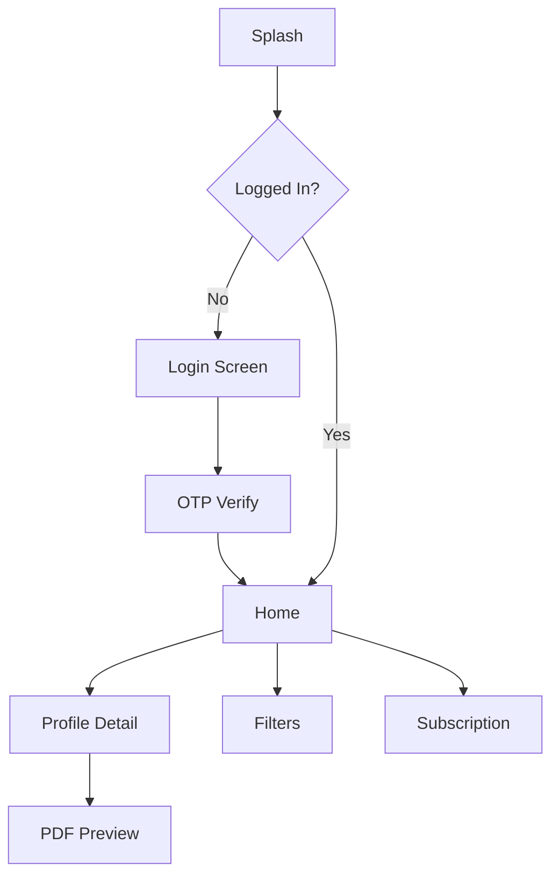

# Wireframes (Low Fidelity) - BanjaraBio

## 1. Global Navigation
| Bottom Tab | Description |
|---|---|
| **Home** | Feed of profiles with basic info (Name, Age, City). |
| **Search** | Filter interface for finding specific matches. |
| **Saved** | List of bookmarked profiles. |
| **Profile** | User's own bio-data, settings, and subscription status. |

## 2. Screen Descriptions

### A. Splash & Login
*   **Splash:** Brand Logo (BanjaraBio) with loading indicator.
*   **Login:** Phone Number input field + "Send OTP" button.
*   **OTP Verify:** 6-digit PIN input + "Verify & Proceed".

### B. Home Screen (Profile Feed)
*   **Top Bar:** App Name, Notification Icon, Filter Icon.
*   **Body:** Vertical scrollable list of cards.
*   **Card UI:** Circular profile photo, Name (Bold), Age/Height, Location. Small "Verified" badge if applicable.

### C. Bio-data Creation (Form)
*   **Step 1:** Personal Details (Name, DOB, Gothra, Height).
*   **Step 2:** Education & Job (Degree, Company, Income).
*   **Step 3:** Family Details (Father's Name, Occupation, Siblings).
*   **Bottom Navigation:** "Previous" and "Next" buttons.

### D. Profile Detail
*   **Cover:** Large Image Gallery (Image Picker).
*   **Middle:** Tab View (Personal, Education, Family).
*   **Actions:** "Download PDF", "Share Connection", "Save Profile".

### E. Subscription Screen
*   **Options:** Monthly, Quarterly, Yearly cards.
*   **Benefits:** Bullet points of premium features.
*   **Pay Button:** Large "Upgrade Now" button triggering Razorpay.

## 3. Interaction Flow (Mermaid)

